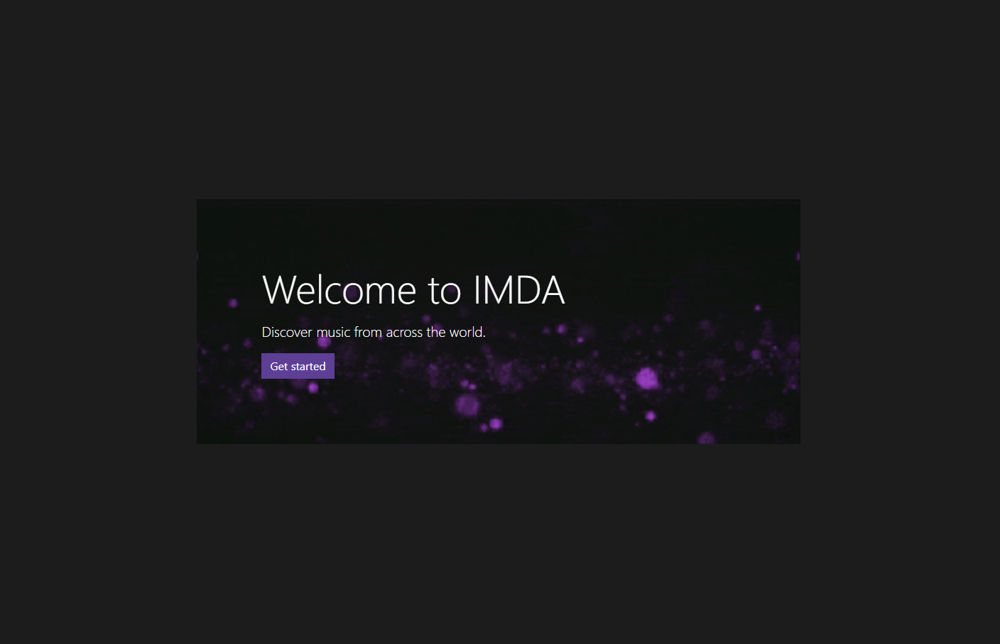

## Project 1 IMDA: International Music Discovery App

## User Story
AS A tourist,
I WANT TO explore music in different countries
SO THAT I can explore the culture

GIVEN an international music discovery app with form inputs
WHEN I search for a song by genre, country and energy level
THEN I am presented with current top 20 songs of a specific country
WHEN I view the songs of a specific country 
THEN I have the option to search for the song's lyrics

Here is the URL of the application:

Here is a screenshot of the International Music Discovery - Lyrics:

Page 1:

Discover page:

Profile page:

